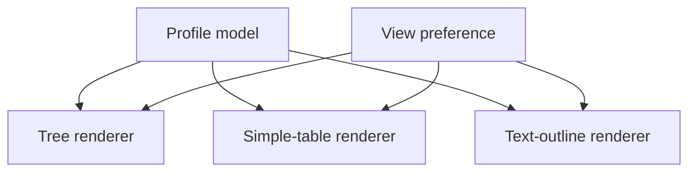

# Alternative Accessible Table Views

[Back to Quick Reference](01-quick-reference.md) · [Generated controls](details/KBD-001-table-controls.md)

## Recommendation

A simplified, text-forward presentation is feasible and could materially help
users who find the generated tree tables visually or operationally difficult.
It should be offered as an **additional view generated from the same underlying
model**, not as a manually maintained duplicate and not only to users detected
as using a screen reader.

The primary generated view should still be improved as far as practical. An
alternate view can support conformance only when it provides equivalent,
current information and functionality, is easy to find from the original
page, and the original presentation does not interfere with its use.

## Proposed user experience

Place a visible view selector immediately before the table tabs:

```html
<fieldset class="profile-view-selector">
  <legend>Profile table presentation</legend>
  <label><input type="radio" name="profile-view" value="tree" checked> Tree view</label>
  <label><input type="radio" name="profile-view" value="simple"> Simplified table</label>
  <label><input type="radio" name="profile-view" value="outline"> Text outline</label>
</fieldset>
```

The choice should:

- be visible to everyone and appear early in keyboard and reading order;
- work without pointer input;
- have an informative accessible name and visible focus;
- persist for subsequent generated pages when storage is available;
- update the URL, for example with `?view=simple`, so the selected presentation
  can be bookmarked and shared; and
- default safely to a usable presentation when scripting is unavailable.

Do not use screen-reader detection, a visually hidden link available only to
assistive technology, or a “high contrast” label for a change that also alters
structure and interaction.

## Three complementary views

### Tree view

Retains the current visual hierarchy after fixing native button semantics,
keyboard operation, state announcements, focus, contrast, and table headers.
This remains useful for sighted users who benefit from the compact hierarchy.

### Simplified table

Uses one row per element and repeats the complete element path rather than
depending on indentation and tree graphics.

| Element path | Cardinality | Type | Flags | Description and constraints |
|---|---|---|---|---|
| `DiagnosticReport.category:LaboratorySlice.coding` | `0..*` | `Coding` | Must Support | Code defined by a terminology system |

Recommended characteristics:

- a real `<table>` with `<caption>`, `<thead>`, `<tbody>`, and scoped column
  headers;
- no row-spanning hierarchy cells or image-based indentation;
- full paths repeated as text;
- abbreviations expanded in accessible names or nearby help;
- optional columns controlled by native checkboxes; and
- horizontal scrolling constrained to the table region when unavoidable.

### Text outline

Presents the content as headings and definition lists. This is often easier for
sequential screen-reader navigation and narrow or highly zoomed layouts.

```html
<section aria-labelledby="element-42-name">
  <h3 id="element-42-name">DiagnosticReport.category:LaboratorySlice.coding</h3>
  <dl>
    <dt>Cardinality</dt><dd>0..*</dd>
    <dt>Type</dt><dd>Coding</dd>
    <dt>Flags</dt><dd>Must Support</dd>
    <dt>Description</dt><dd>Code defined by a terminology system</dd>
  </dl>
</section>
```

This view should support heading navigation and browser text search without
requiring expansion of collapsed ancestors.

## Architecture

Generate all presentations from the same structured profile data:



This avoids synchronization errors and makes equivalent-content regression
tests possible. Each renderer should expose the same element set, cardinality,
type, flags, bindings, constraints, obligations, and descriptions.

## Conformance cautions

1. The selector itself must be accessible before it can serve as the route to
   an alternate presentation.
2. The simplified view must remain current whenever Publisher output changes.
3. Equivalent information must not be omitted merely to make the display less
   visually dense; it may be reorganized or progressively disclosed.
4. Controls in the original view must not create keyboard traps or otherwise
   interfere, even when the alternative is available.
5. A link or selector intended only for screen readers is not recommended.
   Cognitive, low-vision, keyboard, mobile, and other users may also benefit.

## Testing

- Compare the element identifiers and meaningful fields produced by every
  renderer.
- Test keyboard-only operation at 100%, 200%, and 400% zoom.
- Test reflow at a 320 CSS-pixel viewport equivalent.
- Test headings, table navigation, control state, and announcements with
  representative screen readers and browsers.
- Verify direct links and stored preferences do not hide content or strand
  focus after a view change.

## Upstream disposition

This is a Publisher feature rather than a CDC-only template adjustment. The
CDC remediation demonstrates the need, but the renderers should be implemented
where the Publisher constructs profile content so all templates and IGs can
use the same accessible output.

## References

- [W3C: Understanding Conformance](https://www.w3.org/WAI/WCAG21/Understanding/conformance)
- [W3C WAI Tables Tutorial](https://www.w3.org/WAI/tutorials/tables/)
- [WAI-ARIA Authoring Practices: Grid Pattern](https://www.w3.org/WAI/ARIA/apg/patterns/grid/)
